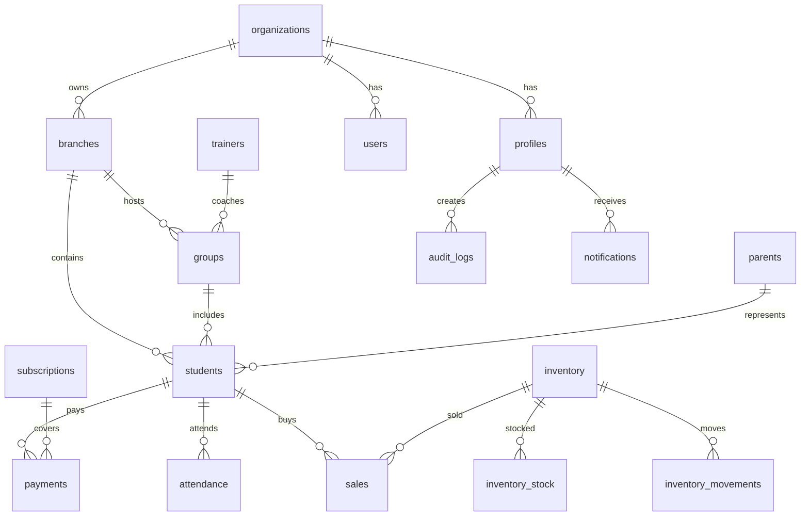

# Database Preparation

## Таблицы

Подготовлены таблицы:

- `organizations`
- `branches`
- `profiles`
- `users`
- `students`
- `parents`
- `groups`
- `trainers`
- `subscriptions`
- `payments`
- `inventory`
- `inventory_stock`
- `inventory_movements`
- `sales`
- `attendance`
- `audit_logs`
- `notifications`
- `student_transfers`
- `invites`

`inventory_stock`, `student_transfers` и `invites` добавлены как production-расширения к исходному CRM UI: они нужны для остатков по филиалам, истории переводов и invite registration.

## Relationship Map

## RLS

Все таблицы в `public` включают Row Level Security. Авторизация не использует `user_metadata`, потому что эти данные редактируемы пользователем. Роли читаются из `profiles.role`, а helper-функции находятся в приватной схеме `app_private`.

## Индексы

Добавлены индексы для типичных CRM запросов:

- ученики по организации/филиалу/статусу;
- полнотекстовый поиск по ученикам;
- оплаты и продажи по датам;
- остатки по товару и филиалу;
- журнал действий по дате создания;
- уведомления по пользователю.
